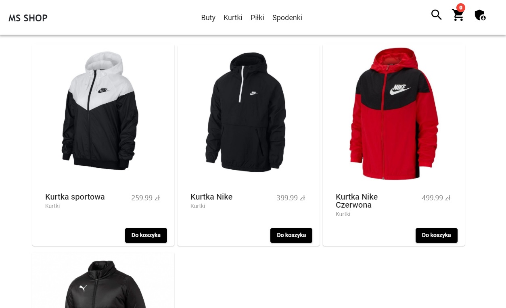
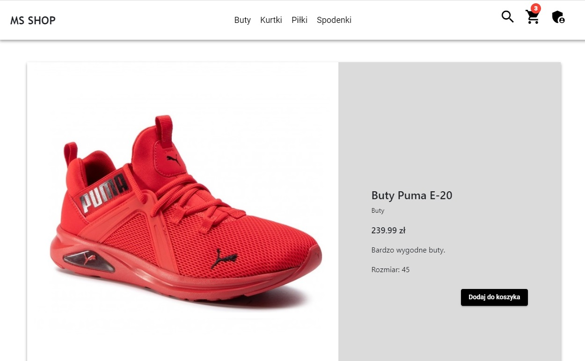
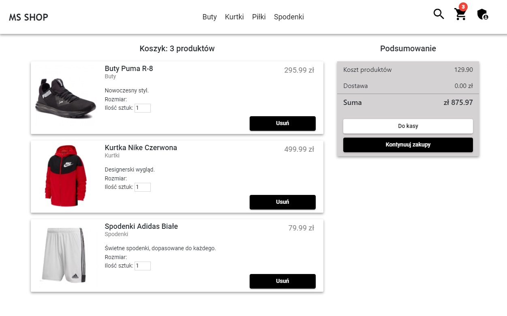
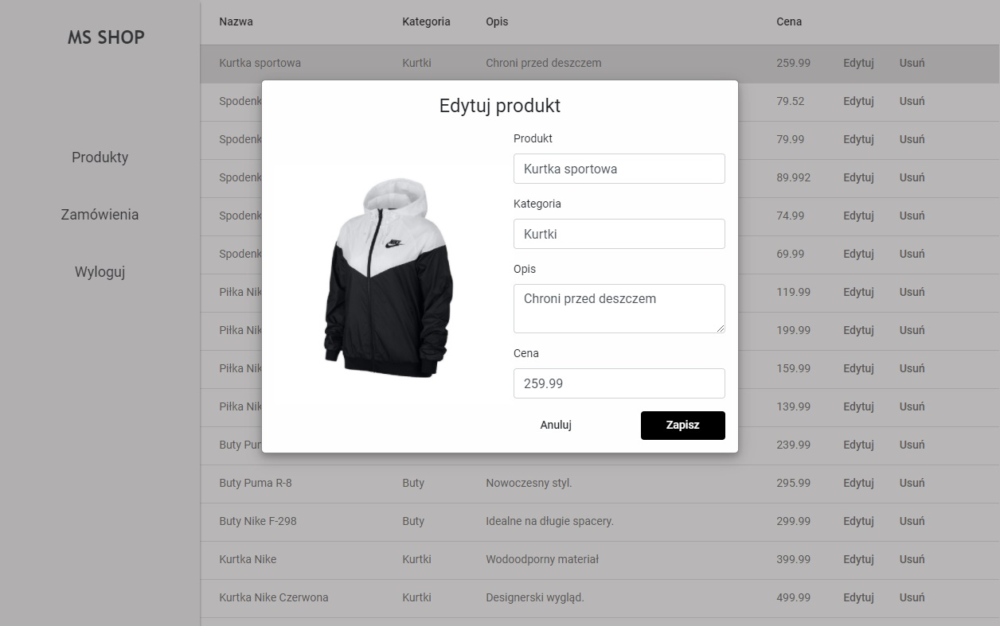

# Store 

## Table of contents
* [General info](#general-info)
* [Overview](#overwiev)
* [Technologies](#technologies)
* [Setup](#setup)
* [ToDo](#todo)

## General info
This is my first bigger Angular project - Online Store. Creating this web-app I have learned how one of the most popular JS framework works and how to use it. I wrote a backend in Node.js and choose MongoDB to store data, so you can easily modify and delete items..

## Overview
In this app you can:
* preview clothes and click it to show details



* add item to cart and show its content and next fill a form order



* log in as an admin, check orders and products. Additionaly you can modify products details(without images) and delete it.



## Technologies
Project is created with:
* Angular v9.1.12
* MongoDB v3.6.1
* Mongoose v5.10.3
* Angular Material v10.1.3
* Bootstrap v4.5.3
* Node.js v12.18.3
* CSS
* HTML

## Setup
To run this project, you'll need Node.js (which comes with npm) installed on your computer. 
```
$ cd ../project-store
$ npm install
$ npm start
```

To run server use:
```
$ cd ../backend/server
$ node app.js
```

## ToDo
* refactor code (delete whitespaces, commented code, unuseful methods)
* add upload images for admin


## Inspiration
Inspiration to making this app was an simple example in Adam Freeman's book - "Angular. Profesjonalne Techniki Programowania". I extended it by creating all views, adding new components, library, authorization, connecting with database and more...
